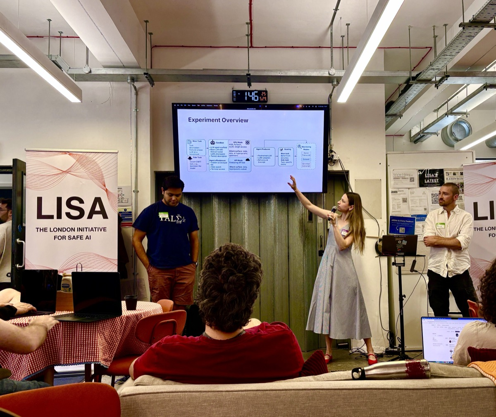

# Yulia Volkova

[yulia-volkova.github.io](https://yulia-volkova.github.io/)

[LinkedIn](https://www.linkedin.com/in/yulia-volkova/) | [GitHub](https://github.com/yulia-volkova) | yuulia.volkova@gmail.com | +447450514095

I am a MATS 9.1 scholar working on AI control evaluations with Rhys Ward and Redwood Research. I have 7+ years of experience building insider threat detection and communication surveillance systems at Behavox for Tier-1 financial institutions. I first hand witnessed AI integration into the regulation sector, which inspired the move to AI safety. My work has been submitted to NeurIPS 2026. Further details can be found on my [website](https://yulia-volkova.github.io/).

### Education

**MSc Economics**, London School of Economics
- Distinction (dissertation)
- Courses included Advanced Macroeconomics, Econometrics, Quantitative Methods

**BSc Philosophy & Economics**, London School of Economics
- Distinction
- Courses included Mathematical Methods, Statistics, Econometrics, Philosophy of Science

### Selected Publications

**Control Evaluations for Covert Malicious Fine-Tuning** *Submitted to NeurIPS 2026*
Buckworth, T., Moreno, R., Panda, A., **Volkova, Y.** Supervised by Dr Francis Rhys Ward.

**Residual Stream Decoders for Probing Model Activations** *Submitted to ICML*
Algoverse AI Safety Research Fellowship. PI: Callum McDougall, mentor: Nicky P. [arXiv](https://arxiv.org/abs/2511.00180)

### Positions and Programs

**[MATS 9.1 Extension](https://www.matsprogram.org/)** Apr 2026 – present
- Continuing control evaluations research under Francis Rhys Ward

**[MATS 9.0](https://www.matsprogram.org/)** Jan – Apr 2026
- Control evaluations for covert malicious fine-tuning under Francis Rhys Ward, advised by Tyler Tracy and James Lucassen (Redwood Research)
- Selected for MATS 9.0 Spotlight Talk — opened the London event ([YouTube](https://youtu.be/_ZptPpgc7_g))

**[Athena Women in AI Safety Research Fellowship](https://researchathena.org/)** Nov 2025 – Jan 2026
- Mechanistic interpretability approach to monitoring chain-of-thought faithfulness under Arun Jose
- Gathered feedback from Adam Karvonen, Goodfire team, and Uzay Macar; integrating in MATS 9.1 extension phase

**[SPAR Fellowship](https://sparai.org/)** Oct – Dec 2025
- CoT monitorability project under Qiyao Wei (MATS 8.0, Cambridge University)

**Visiting Member at [London Initiative for Safe AI (LISA)](https://www.safeai.org.uk/)** Sept 2025 – present

**[Algoverse AI Safety Research Fellowship](https://algoverseairesearch.org/ai-safety-fellowship)** Jul – Aug 2025
- Two concurrent research projects:
  1. Mechanistic interpretability under Nicky P
  2. Cooperative AI under Max Kleiman-Weiner

**[ARBOx2 Oxford AI Safety Bootcamp](https://oaisi.org/arbox/)** Jul 2025
- Completed the ARENA curriculum

### Talks

- **MATS 9.0 Spotlight Talk** — opened the London event ([YouTube](https://youtu.be/_ZptPpgc7_g))
- **MATS Project Talks at [LISA](https://www.safeai.org.uk/) and Google DeepMind London** (Jun 2026) — presented the covert malicious fine-tuning project (F. R. Ward's stream) to research audiences at both offices

  

- **FellowCast Podcast at [Constellation](https://constellation.org/)** — "Covert Malicious Fine-Tuning" ([Spotify](https://open.spotify.com/episode/3c8H6KKFCNwWfEj28GcXmH))

### Work Experience

**Behavox** — *Insider threat detection, communication surveillance, and compliance* 2017–2025

**Data Science Production Team Lead** 2024–2025
- Led development and deployment of LLM-driven Java applications across 3 products and 14 languages, using a pipeline of fine-tuned models (SBERT -> DeBERTa -> Qwen-14B)
- Managed execution of Java applications on the Apache Beam Dataflow runner; monitored GPU utilization and used BigQuery datasets to debug pipeline behavior and resolve incidents
- Led cross-team roadmapping for ML features under production constraints
- Built reusable tooling—CI/CD templates and MLflow tracking—enabling rapid MVPs for client deliveries

**Insider Threat Product Lead** 2020–2024
- Designed risk taxonomy and classifiers for insider threats — data exfiltration, disgruntlement, flight risk
- Worked directly with heads of insider risk at Citadel, SoftBank, and other Tier-1 financial institutions to validate detection models against real threat landscapes
- Led R&D and production of high-recall (81% at 0.5% FPR) misconduct detection systems using RoBERTa + SBERT models architecture pipeline
- Validated and proved that shorter text sequences in RoBERTa training maintain performance, doubling training speed and halving company training costs
- Built internal tooling (chatbot, recommendation system) serving 200+ daily users, leveraging RoBERTa/SBERT embeddings, K-Means clustering, and CatBoost

**Data Scientist** 2017–2020
- Landed proof of concepts that resulted in 3+ years client contracts
- Improved compliance model recalls from 70% to 90%
- Reduced client bug requests from 1/day to 1/month by setting up an efficient QA process
- Self-studied Java to remove the Analytics dependency on Backend teams
- One of the first Data Science hires; created foundational documentation during company scaling

### Additional Skills and Interests

**Programming Languages**: Python, PyTorch, HuggingFace, Pandas, NumPy, Scikit-learn, FastAPI, spaCy, SQL, Java, Kotlin
**Machine Learning & NLP**: LLM fine-tuning (LoRA/qLoRA), prompt engineering, transformers, SBERT, PCA, t-SNE, models evaluation (precision, recall, ROC/PR-AUC, F1), Weights & Biases
**Infrastructure**: AWS S3, GCP, Docker, Nomad, Kubernetes, TeamCity, Gitlab CI/CD pipelines
**Statistics & Econometrics**: Hypothesis testing, time-series analysis, A/B testing, IV estimation, panel regression
**Leadership**: Mentorship, technical interviewing, product roadmapping, cross-team communication
**Other Interests**: Oil painting, skiing, hiking

